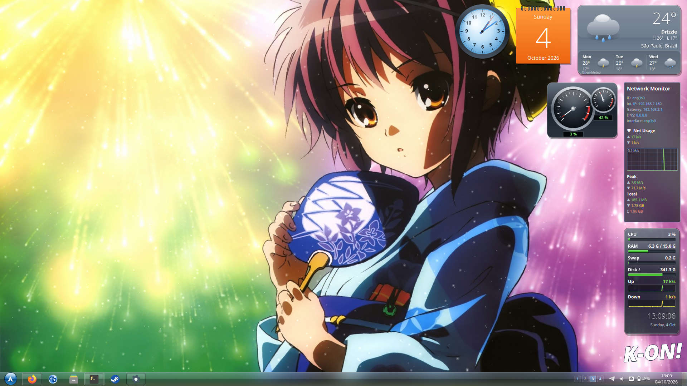

# kon

A Frutiger Aero rice for [aro](https://github.com/simeulinuxkaliaiwr/aro),
Hyprland and niri: a superbar taskbar with a start orb, glass windows, desktop
gadgets, Flip 3D and falling snow.

## What's in it

| | |
|---|---|
| compositor | aro, Hyprland or niri, each with a themed config |
| shell | Quickshell, `aroclip`: taskbar, start menu, Flip 3D, clipboard, emoji, OSDs, screenshots and recording |
| gadgets | clock, calendar, weather, CPU meter, network monitor |
| theming | `kon`: renders the Aero palette, shape and motion into the compositor and every app below |
| terminal | foot, JetBrains Mono Nerd Font |
| notifications | mako |
| lock | swaylock over a blurred wallpaper (`kon-lock`) |
| also themed | GTK 3/4, qutebrowser, fuzzel, btop, cava, starship, fastfetch |
| icons, cursor | Papirus-Dark, Windows8-cursor |

## Install

Arch packages:

    quickshell-git foot mako fuzzel swayidle swaylock cliphist wl-clipboard
    grim slurp wl-screenrec hyprpicker brightnessctl wireplumber networkmanager
    libqalculate jq imagemagick python papirus-icon-theme windows8-cursor
    ttf-jetbrains-mono-nerd

and one or more of: `aro-git`, `hyprland` (0.56 or later, Lua config), `niri`
(26.04 or later, for blur).

Optional, themed if installed: qutebrowser btop cava starship fastfetch

Then:

    git clone https://github.com/simeulinuxkaliaiwr/kon
    kon/install.sh

It asks which compositors to set up and how: window layout, keyboard layout,
Hyprland's monitor scale, a city for the weather (or your IP), snow, and a
wallpaper, then shows a summary before changing anything. To skip the
questions, name the compositors (`kon/install.sh niri hyprland`) or pass `-y`
for the defaults on every compositor installed. Anything it replaces is kept
as `*.pre-kon`. Log in and run `kon`.

On Hyprland your own `hyprland.lua` stays: the rice is added to its end with
`require("kon-aero")`, and its keys replace yours where they overlap. Without a
config it starts from Hyprland's default one. A `hyprland.conf` (the old
format) is left alone and Hyprland is skipped.

Wallpapers aren't included; the installer can copy one in.

The weather gadget finds your location from your IP (ipinfo.io) and gets the
forecast from Open-Meteo, unless you gave the installer a city. To change it
later, set `pinCity`, `pinLat` and `pinLon` in
`~/.config/quickshell/aroclip/Aero.qml`.

To change colours, edit `~/.config/kon/themes/aero.json` and run `kon` again.

## Compositors

| | aro | Hyprland | niri |
|---|---|---|---|
| layout | scrolling | yours (dwindle by default) | scrolling |
| blur | windows and glass | windows and glass | windows and glass |
| Flip 3D (`mod+Tab`) | yes | yes | niri's overview instead |
| taskbar previews | yes | yes | no, niri doesn't place tiled windows |
| drop-down terminal (`mod+'`) | yes | yes | no |
| wallpaper picker (`mod+w`) | yes | no | no |
| tabbed groups | yes | yes | tabbed columns |

## Keys

| | |
|---|---|
| `mod+q` | terminal |
| `mod+a` / `mod+shift+a` | start menu / fuzzel |
| `mod+Tab` | Flip 3D |
| `mod+o` | overview (aro, niri) |
| `mod+v` | clipboard history |
| `mod+'` | drop-down terminal |
| `Print`, `mod+Print` | screenshot, area |
| `mod+shift+Print` | record screen |
| `mod+shift+c` | colour picker |
| `mod+.` | emoji |
| `mod+hjkl` | focus; add `shift` to move, `ctrl` to resize |
| `mod+1`…`8` | workspace; add `shift` to send the window there |
| `mod+escape` | lock |

The full lists are in `config/aro/config` and
`config/niri/config.kdl`; on Hyprland the rice's are in
`config/hypr/kon-aero.lua`.

## License

GPL-3.0, see [LICENSE](LICENSE).

## Credits

The K-ON! logo is fan art; K-On! belongs to Kakifly and Kyoto Animation.
